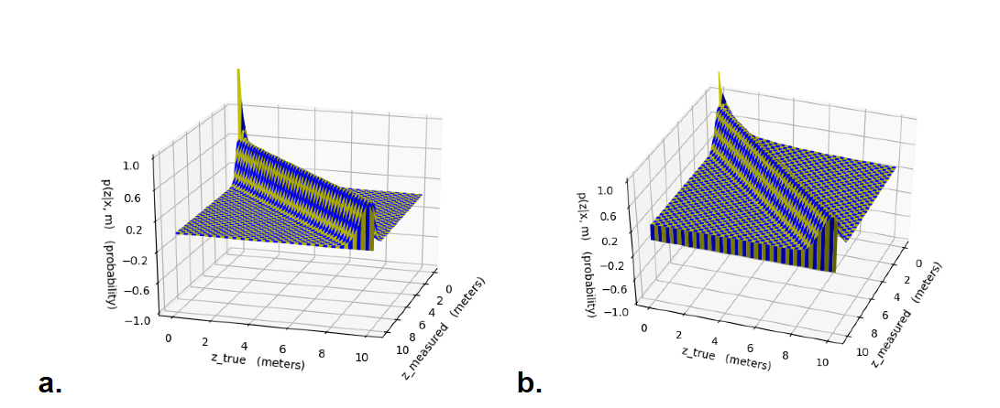
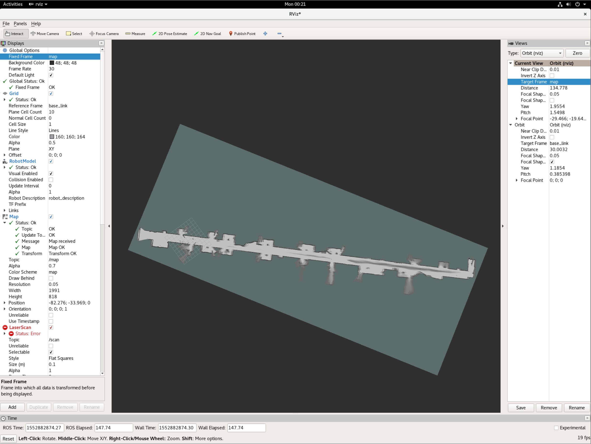

# Lab 5

Slides for this lab are also accessible [here](https://docs.google.com/presentation/d/1NuDpnbKnr5Q-sfzRN80VtYCx-H2BmiSQMGYetTSKh0Y/edit?usp=sharing).

## **Overview and Motivations**
### *Mohammed Nasir*

As we worked through past labs, we learned how to use sensors to follow a wall, detect objects in the world, as well as command steering based on our collected sensor data. This lab involved bringing it all together to locate ourselves in the world. However, there is no easy way to find our absolute position. We must rely on our position relative to other objects, which we can then use to infer our position relative to the Earth.

A real-world analogy of this is a person walking in a desert while blindfolded. They only know their initial position, but they are primarily relying on their steps to mentally infer their position at any later given time. In this lab, we did just that: we incorporated “steps” to give us a rough estimate of our position, given our initial position. However, this is not perfect, since the position estimate will drift over time. In the desert analogy, the miniscule slippage under the person’s foot at every step introduces a little bit of error between the estimated and actual positions, which accumulates over multiple steps. Therefore, we need to use sensors to correct our estimate from time to time.

Human eyesight is an extremely complex and elaborate way of sensing the world compared to modern machine vision technology. However, for the purposes of this lab, we will be using LIDAR to sense our environment. A real-world analogy for this scenario would be a room with an uneven sand floor and a wall layout that is known to the person. Essentially, they can use their hands to touch the wall and “feel” their way around the room, in addition to using their steps to estimate position when the wall is out of reach. In our lab implementation, we had our robot use the LIDAR scan data to sense the distances to the nearby walls, and used our knowledge of the map to estimate our location.

As technology progresses towards a more automated future, it becomes increasingly important for machines to know where they are in relation to the world. ‘Self-driving vehicles’ is the canonical example: the benefit the technology brings (quite literally) depends on how well it can locate itself in the world. With other vehicles, pedestrians, and obstacles on the road, there is very little room for error with localization, and this lab brings us closer to achieving that.

## **Proposed Approach**
### *Tanya Smith*

In order to localize the robot on a known map of the MIT Stata building basement, we implemented the Monte Carlo Localization particle filter method. The word “particle” in this method refers to the fact that we maintained a cloud of particles representing possible locations and orientations for the car, and the word “filter” refers to the fact that certain particles were periodically filtered out based on having a low probability of accurately describing the car’s position. 

 We implemented a motion model and a sensor model as subcomponents of this method, and used the particle filter to put the two together. On each timestep, the motion model updated the locations and orientations of each particle based on the odometry of the robot. The details of this odometry calculation are explained in the motion model subsection below. Periodically, the sensor model calculated the probability that each particle accurately represents the car’s current location; the particle filter would then resample a new particle cloud according to these probabilities. The parameters of the sensor model were chosen to optimize the speed and responsiveness of our code. The details of how the sensor model works are explained in more further in the sensor model subsection below.

__**Technical Approach: Motion Model**__

At every timestep, the motion model updated the locations and orientations of each particle based on the proprioceptive odometry data of the robot. This essentially means using the robot’s linear and angular velocities to calculate new positions based on the physical laws of motion. 

To understand the calculations necessary to make these updates, we will define the concept of the world frame and the body frame. The frame of reference means the axes with respect to which we are defining the positions and orientations of the particle. If the location of a particle is given in the world frame, it means the frame of reference of the global map. If it is given in the body frame, it means the frame of reference of the car, which changes depending on the movements of the car.

To update the position of each particle, we used the linear and angular velocities of the odometry data to calculate the changes in location and orientation. Because the odometry data we subscribed to was given in the body frame of the car, we then used a rotation matrix to transform these changes into the world frame. Finally, we added the changes to the old location and orientation to obtain the new ones. In simulation, we also added Gaussian noise to these changes, to account for the unavoidable noisiness of the real robot’s odometry data.

Due to this noise in the odometry data, whether real or simulated, using the motion model alone is not enough to perform accurate localization. The noise causes the locations of the particles to diverge over time until the particle cloud is far too large and inaccurate to be useful. This is demonstrated in Figure 1 below, in which the particle cloud diverges when the motion model is the only code affecting the locations of the particles. In order to combat this divergence, we used periodic sensor model updates based on exteroceptive measurements, which is explained in the next subsection.

<iframe src="https://drive.google.com/file/d/17MmxgFGmrDhao2rxZ3w01SXUjSMscv8a/preview" width="640" height="480"></iframe>

***Figure 1 - Particle Cloud Divergence Based on Only Motion Model***
*This video shows the particle filter running with only the motion model turned on, which results in the particle cloud diverging quickly from the actual position of the robot.*

__**Technical Approach: Sensor Model**__

Every 10 timesteps, the sensor model was applied in order to counter the divergence of the particle cloud. We chose this frequency of 10 timesteps because using the sensor model any more often made our code too slow and unresponsive, which manifested in lag in our simulation. The job of the sensor model was to assign probabilities, or weights, to each particle for how likely they were to accurately describe the location and orientation of the car, based on comparing measured lidar data to the hypothetical lidar data that the robot would see if it were at that particle.

In order to calculate the probability of a particle, we used a weighted sum of probabilities for four cases, taken from the instructions of the lab:

1. Probability of detecting a known obstacle in the map, like a wall
2. Probability of a short measurement, possibly due to internal lidar reflections, hitting parts of the robot, or other obstacles not on the map like chairs or people
3. Probability of a very large measurement due to lidar beams that hit an object with strange reflective properties and don’t bounce back to the sensor
4. Probability of a completely random measurement

We used the weights 0.74, 0.07, 0.07, and 0.12, respectively, when summing these probabilities to get the overall probability of the particle. This reflects the fact that properly detecting a wall, is far more likely than an internal reflection or encountering a reflective surface in the Stata basement, which are in turn both less likely than a random measurement of unknown origin.

Doing the math to compute this probability for every particle every time we called our sensor model would have made our code too slow, so we chose to precompute a probability distribution for a select grid of measured lidar measurements and hypothetical measurements, shown in Figure 2 below. This way, when we needed to assign a probability to a particle, we could simply look it up in the precomputed distribution, which was much faster.

</img>

***Figure 2 - Precomputed Probability Distribution for Sensor Model***
***2a*** *shows the probability distribution in space of measured lidar distances vs. hypothetical lidar distances, before any processing, which has a very exaggerated peak when both distances approach zero.*
***2b*** *shows how we made this peak less dramatic by raising all probabilities to the 1/3 power, which was helpful because it allowed more particles to have nonzero probabilities, and maintaining a larger cloud of particles ultimately made it easier to locate the robot.*

Running our particle filter with only the sensor model active, as in Figure 3, clearly illustrates its functionality. The sensor model assigned probabilities to the particles by comparing exteroceptive measurements to their hypothetical lidar data, and the particle filter resampled the cloud based on these probabilities, until the cloud shrank to a narrower set of guesses for the location and orientation of the robot. This resampling process will be further explained in the next subsection.

<iframe src="https://drive.google.com/file/d/1EQ30qRff-om9ebdYshe1yTw2Q1MZDOVG/preview" width="640" height="480"></iframe>

***Figure 3 - Particle Cloud Convergence Based on Only Sensor Model***
*This video shows the particle filter running with only the sensor model turned on, which results in the particle cloud converging towards the true position of the robot.*

__**Technical Approach: Particle Filter and ROS Implementation**__

When put together, the motion model and the sensor model formed a basis for maintaining a cloud of particles that tracked the location and orientation of the robot as it traversed the known map of the Stata basement. The job of the particle filter was to integrate these two models into a meaningful method for updating the particle cloud to reflect changes in both odometry and lidar data received by the robot.

When odometry data was received, the particle filter would pass the changes in position and orientation to the motion model, which would then calculate the new position and orientation of each particle as described above. The particle filter would then revisualize the particles in the simulation, reflecting their new positions. In Figure 4 below, the ROS node graph shows that the particle filter subscribed to the /odom topic to receive this odometry data and published the particle cloud visualizations to the topic /particle_markers.

When lidar data was received, if it had been long enough since the last time the sensor model was called, the particle filter would pass the lidar data to the sensor model. The sensor model would then compare this observed lidar data to hypothetical lidar data calculated by ray-tracing from each particle, returning weights from the precomputed probability distribution for each particle. The particle filter normalized these weights so that they all summed to 1, which allowed them to be used as a probability distribution in their own right when resampling the particle cloud. This resampling entailed picking a new cloud of particles of the same size, and drawing the positions and orientations of these new particles from the old ones according to the normalized distribution of weights. Once again, the particle filter would revisualize the particles in the simulation to reflect this resampling. In Figure 4 below, the ROS node graph shows that the particle filter subscribed to the /scan topic to receive this lidar data and published the particle cloud visualizations to the topic /particle_markers.

In addition to publishing visualizations of the particles to /particle_markers, the graph of ROS nodes in Figure 4 shows that the particle filter also published the error between the ground truth position of the car and our estimated position to /transform_error in simulation, as well as lidar scan data inferred from that estimated position to /inferred_scan in both simulation and real life. Instead of just performing a basic weighted average of all the particles to calculate this estimated position, we used a multi-modal averaging algorithm to account for the cases in which our particle cloud split into two visibly distinct subclouds at different locations on the map. In these cases, our algorithm would select the cloud containing the highest probability, and only average the particles in that cloud. In Figure 5 below, this estimated position and orientation is visualized as a transform which follows the true robot around the map, and the lidar data published from the perspective of this estimated position mostly matches the walls that are actually around the robot.

</img>

***Figure 4 - Graph of Nodes and Topics for ROS Implementation***
*This graph details the nodes and topics of our ROS Implementation. Of note are our particle filter node, which subscribes to /odom and /scan for odometry and lidar data, as well as the topics it publishes to: /transform_error for error between ground truth and estimated position, /particle_markers for visualizing the particle cloud, and /inferred_scan for visualizing the inferred lidar data from the perspective of the estimated position.*

<iframe src="https://drive.google.com/file/d/1HCdgYHMbd7PIHy-9EyaOPvzBclRjZvpb/preview" width="640" height="480"></iframe>

***Figure 5 - Particle Filter Localizing Car with Inferred Position and Lidar Data***
*This video shows the particle filter running in simulation with both the motion and sensor models on - the converging of the sensor model counters the diverging of the cloud due to the motion model. The red, green, and blue axes are the transform showing our estimated car position, which follows the car as it moves. The lidar data that mostly matches up with the walls is given from the perspective of that transform.*

## **Experimental Evaluation**
### *Jordan Gamble*

In order to evaluate the performance of our localization model in simulation, we plotted and analyzed our cross-track error and convergence rates to determine its accuracy and speed. The cross-track error looks at the difference between the position and orientation of our predicted model and actual model. The transform used for the cross-track error is given in terms of an x, y, and z transform where x and y transform represent the x and y position of the car with respect to the map frame, and the z-transform represents the angle with respect to the map frame. 

If our localization model was able to perfectly model the movement of the car in simulation, then all three transform errors would be zero. However, as seen in Figure 6, we found that our z-transform error steadily built up over time. This is likely due to the fact that we used a regular averaging method to predict our angle rather than using the suggested circular mean method which takes into account that for angles 0 and 360 degrees are equivalent. Another problem we encountered with our cross-track error is that our x-transform would occasionally spike when maneuvering around a complicated corner. This error was typically associated with the predicted position thinking it was ahead of the actual position of the car. After some time these deviations re-converged. In the final version of our car, we would like to implement a mean of circular quantities on the angle to reduce this error. 

</img>

***Figure 6 - Cross Track Error in Simulation***
*This plot was generated after running our simulated car through the hallways of the Stata basement and calculating the difference between our predicted transform and the real transform. The x and y transform error are the x and y position of the transform in the map frame and the z transform error is the error in angle orientation. Two consecutive trials are shown in this graph. The x and y transform errors show high accuracy with occasional increases in the x error. However, the z transform steadily diverges.*

On top of measuring the accuracy of our localization model, we were also concerned with how fast our motion particles converged around the real robot’s position. To do this, we published the standard deviation of the vectorized coordinates of the particle cloud and plotted these standard deviations over time. Figure 7 shows this plot being generated in real time next to our simulation. As seen in this video, the initial standard deviation of the particle cloud starts around 1 then slowly levels off around 0.2. A closer look at the final plot can be seen in Figure 8. This entire process takes around 7 seconds which we estimate to be our convergence rate. 

<iframe src="https://drive.google.com/file/d/1HLRAvEz-OjQdBibdQvklykJTTIk-JWRC/preview" width="640" height="480"></iframe>

***Figure 7 - Video of Convergence Error in Simulation***
*This video shows the convergence error being generated with respect to our robot simulation. The particle cloud quickly condenses into a bimodal model, which then converges around the actual robot’s position in about 7 seconds.*

</img>

***Figure 8 - Final Plot of Convergence Error in Simulation***
*The final plot generated from Figure 7. Upon initializing the particles, our standard deviation starts from 1 and converges around 0.2. Our final convergence rate is about 7 seconds.*

## **Experimental Evaluation Bonus: Cartographer**
### *Mohammad Nasir*

The Google Cartographer is a software package used for Simultaneous Localization And Mapping (SLAM). It runs on the robot, using odometry data taken from the drive system as well as kinematic measurements from the IMU. It synthesizes this information with readings from the LIDAR to generate a map of the robot’s surroundings. As we implemented it on the robot, we found that there were a few parameters to set in the racecar_2d.lua file before it was minimally functional, as shown below:

use_landmarks = false,
publish_frame_projected_to_2d = true,
landmarks_sampling_ratio = 1.,

We used the 2D implementation of Cartographer, since our robot was equipped with the 2D Hokuyo LIDAR. We looked at the other parameters and looked through the documentation to understand what each of them do. Without changing any of them, we got fairly reasonable results as shown in the figure below:

</img>

***Figure 9: Map generated by Cartographer***
*This figure shows a map of the 6th floor of Simmons Hall that was generated without any modifications to the stock parameters.*

We began at the far left side (in the image) and drove down the hall at a speed of ~0.75m/s to minimize slippage and to allow the cartographer sufficient time to process all the incoming data. The right side of the image seems to be a bit blurry, since we did multiple passes and they seem to have not aligned perfectly. A future improvement to this implementation would be to adjust the parameters to tune loop closure performance.

We recorded a video of the robot driving while the cartographer generates the map of the hall, and this is shown below:

<iframe src="https://drive.google.com/file/d/18lh49fHUdUaBO0pClvWbeRkTfDXUsEWQ/preview" width="640" height="480"></iframe>

***Figure 10: Video of Cartographer map generation***
*This figure shows the robot driving through the hall as the Cartographer generates a map of the surroundings. (Video sped up 3x)*

## **Lessons Learned**
### *Olivia Siegel*

As it was everyone in the groups first time implementing a particle filter, we had many learning moments and several lessons learned. The first was that we didn’t use the circular mean instead of averaging angle values, like it said to do in the lab. Circular mean for angles is more accurate than just a regular mean because you convert from polar to cartesian, average, and then convert back to polar. Our angle error built up over time due to not using the suggested circular mean method which takes into account that for angles, 0 and 360 degrees are equivalent. Another lesson learned was we spent a good amount of time trying to make our algorithms faster and we probably would have had better luck if we used more built in numpy functions. All in all, a great learning experience. 

## **Future Work**
### *Olivia Siegel*

As mentioned in the lessons learned, we could make things faster by using built in numpy functions and a circular mean. If we were to continue working on this lab, that is what we would do. However, we are looking forward to implementing the next lab, which is a path planning and trajectory tracking lab!

#### *This report was edited by Jordan Gamble.*